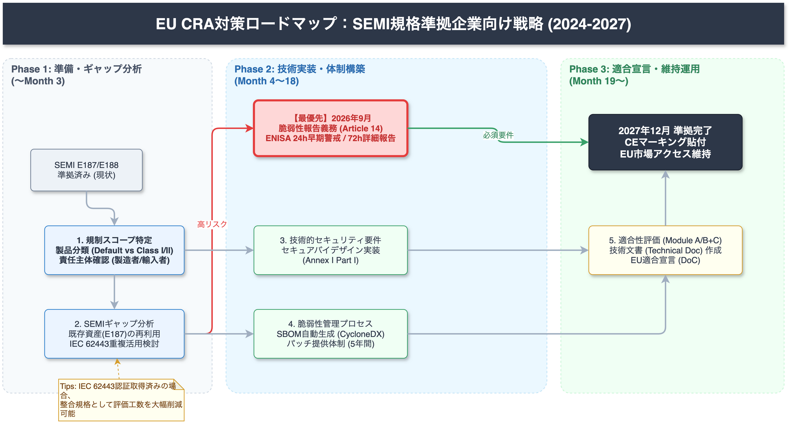
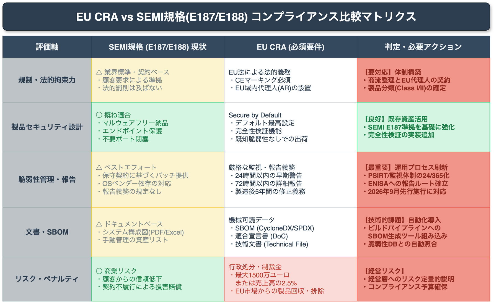
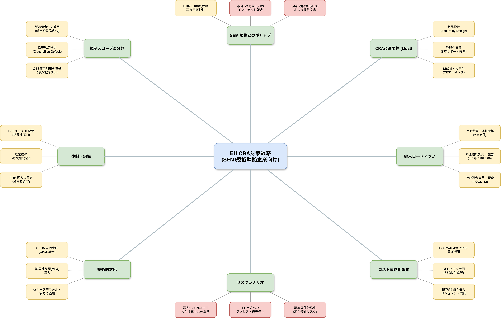
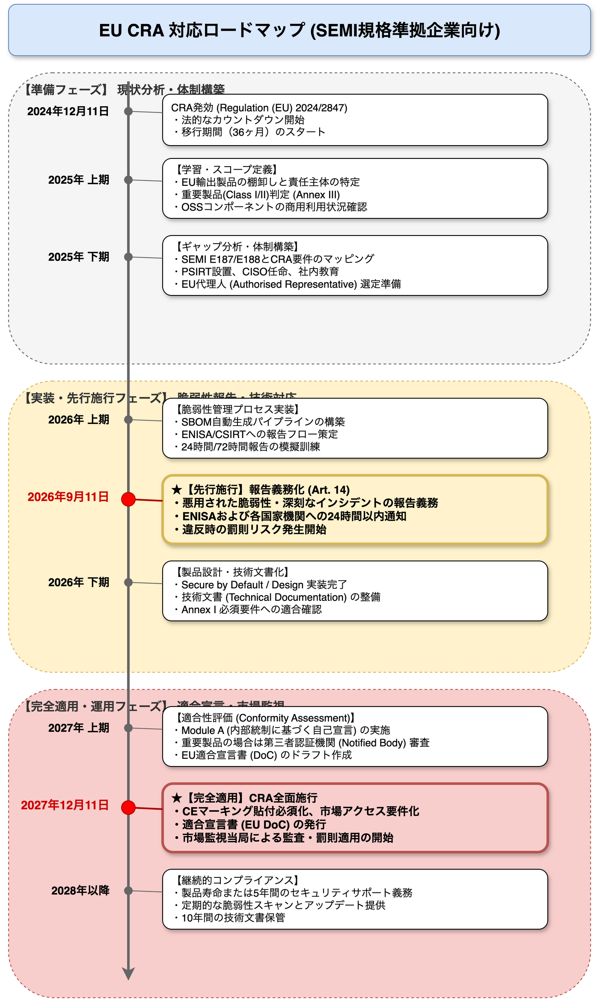

<!-- _class: title -->
# EU CRA対策戦略
## SEMI規格準拠企業向け技術ロードマップ

2026-03-17
AI Research Agent

---
<!-- _class: light -->
# エグゼクティブサマリー

SEMI E187/E188準拠をベースに、EUサイバーレジリエンス法（CRA）への効率的な対応を目指します。開発チームは以下の重要マイルストーンを認識する必要があります。

- **最優先期限**: **2026年9月**（脆弱性・インシデント報告義務の先行施行）
- **完全施行**: **2027年12月**（セキュアバイデザイン、SBOM、CEマーキング）
- **基本戦略**: SEMI準拠資産の最大活用＋報告プロセスの新規構築
- **コスト影響**: 脆弱性管理プロセスの維持コスト（5年間サポート義務）

 
Confidence: High 法的施行スケジュールは確定済みです。

---
<!-- _class: light -->
# 1. CRA適用範囲と対象製品

半導体製造装置の制御PC、組み込みOS、ファームウェアは「デジタル要素を含む製品（PDEs）」として**CRA規制の対象**となります。

- **ハードウェア・ソフトウェア**: EU市場に上市される全てのPDEsが対象
- **OSSの扱い**: 商用製品に組み込まれたOSSコンポーネントは製造者責任
- **SaaS**: リモート処理のみならNIS2対象だが、デバイス側コンポーネントがあればCRA対象

**開発チームへの影響**:
既存の出荷済み製品に対するサポート期間とパッチ提供義務の範囲特定が急務です。

High Article 2 (Scope)

---
<!-- _class: light -->
# 2. 重要製品分類（Class I/II）の判定

多くの半導体製造装置は「デフォルトカテゴリ」ですが、産業用オートメーション制御システム（IACS）等の機能を持つ場合は**Class I/II**に分類される可能性があります。

- **Default Category**: 自己適合宣言（Module A）が可能。第三者認証不要。
- **Class I/II**: 第三者機関による関与が必要になる可能性あり。
- **判断基準**: ネットワーク機能、特権アクセス管理機能の有無。

**開発チームへの影響**:
Annex IIIリストに基づき、自社製品機能が「重要製品」に該当しないか精査が必要です。

Medium Annex III / Recital 10

---
<!-- _class: light -->
# 3. SEMI E187/E188とのギャップ分析

既存のSEMI規格対応は有用ですが、CRA準拠には**不足領域（Gap）**があります。ここを埋めることが技術対応の焦点です。

| 領域 | SEMI E187/E188 | EU CRA (Annex I) | ギャップ |
| :--- | :--- | :--- | :--- |
| **OS強化** | 対応済 (Hardening) | 必須 | **小** (再利用可) |
| **SBOM** | Software Inventory | 機械可読SBOM | **大** (形式変換必須) |
| **脆弱性管理** | パッチ適用プロセス | **24時間以内**の報告 | **特大** (運用体制) |
| **設計** | マルウェアフリー | セキュアバイデフォルト | **中** (証明が必要) |

High SEMI E187/E188 vs CRA Annex I Mapping

---
<!-- _class: light -->
# 4. 技術戦略：SBOMの実装

SEMI E188で要求される「Software Inventory」を、CRAが求める機械可読な**SBOM（CycloneDX/SPDX）**へ変換・高度化する必要があります。

- **必須要件**: 脆弱性データベースとの自動照合が可能な形式であること
- **推奨ツール**: Syft, Grype, Dependency-Track等のOSS活用
- **運用**: ビルドパイプラインへのSBOM生成組み込みと、出荷後の構成管理

**開発チームへの影響**:
手動管理のインベントリから、CI/CD統合型のSBOM自動生成フローへの移行が必要です。

Medium CRA Annex II / E188 Specification

---
<!-- _class: light -->
# 5. 技術戦略：脆弱性報告（Article 14）

**2026年9月**より、悪用された脆弱性や深刻なインシデントについて、**認知から24時間以内の「早期警告」**が義務化されます。

- **Early Warning**: 24時間以内にENISA/CSIRTへ第一報
- **Full Notification**: 72時間以内に詳細報告
- **Final Report**: 修正完了後または1ヶ月以内

**開発チームへの影響**:
技術的な検知から法務・広報へのエスカレーションを含む、緊急対応フローの確立と演習が不可欠です。

High Article 14 (Reporting Obligations)

---
<!-- _class: alert -->
# 未対応時のリスク（Alert）

CRAに違反した場合、ビジネス存続に関わる重大なペナルティが課されます。

- **制裁金**: 最大 **1,500万ユーロ** または 全世界売上高の **2.5%**（高い方）
- **市場アクセス**: EU市場での**販売停止・回収命令**（リコール）
- **サプライチェーン**: SEMI準拠を求める顧客からの取引停止（適合宣言書が出せないため）

単なる努力目標ではなく、**「EUへの輸出許可証」**と捉える必要があります。

High Article 53 (Penalties)

---
<!-- _class: success -->
# 段階的導入ロードマップ（Action Items）

開発チームが着手すべきアクションと期限です。

1.  **Phase 1: 調査・定義 (〜2024 Q4)**
    - 製品分類（Default vs Class I/II）の確定
    - EU代理人（Authorised Representative）の指名準備
2.  **Phase 2: 体制構築 (〜2026 Q2)** 🔴 **最優先**
    - **24時間脆弱性報告フロー**の策定とPSIRT体制強化
    - 既存SEMI資産のCRAマッピングドキュメント作成
3.  **Phase 3: 技術実装 (〜2027 Q3)**
    - CI/CDパイプラインへのSBOM生成・脆弱性スキャン統合
    - 技術文書（Technical Documentation）の整備と適合宣言（DoC）準備

Medium Implementation Roadmap based on CRA Timeline

---
<!-- _class: dark -->
# 結論：法令対応を競争力へ

CRA対応はコストですが、回避不能な市場参入要件です。

- **SEMI規格の貯金**を活かし、ゼロベースの競合より有利な位置にいます。
- まずは**「2026年9月の報告義務」**をターゲットに、PSIRT体制を整備しましょう。
- 自動化（SBOM/VEX）への投資は、長期的にはソフトウェア品質向上に寄与します。

**Next Step**:
対象製品リストの棚卸しと、SEMI E187/E188対応状況の精査を開始してください。

---

<!-- _class: light -->
<!-- _backgroundColor: white -->

---

<!-- _class: light -->
<!-- _backgroundColor: white -->

---

<!-- _class: light -->
<!-- _backgroundColor: white -->

---

<!-- _class: light -->
<!-- _backgroundColor: white -->

---

<!-- _class: dark -->

## Thank You

AI Research Agent によるリサーチ結果をご覧いただきありがとうございました。

本資料に関するご質問・フィードバックをお待ちしています。
